# ARBITRA Artifact Foundry

<div align="center">
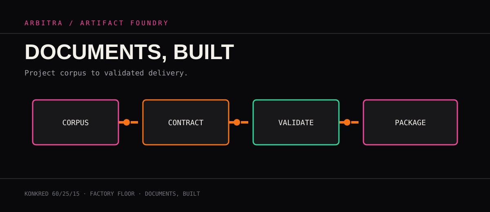

**A visual factory for structured, validated, exportable enterprise deliverables.**

[](https://www.typescriptlang.org/) [](https://react.dev/) [](https://zod.dev/)
</div>

> **KONKRED 60/25/15** — 60% factory system, 25% technical product narrative, 15% installation and verification.

## The product

ARBITRA turns a project corpus into an organized artifact suite. The working surface is a factory floor: ingest the source context, classify the intended output, select an artifact contract, generate with AI, validate the result, review the build log, and package the delivery.

It addresses a practical documentation problem: project knowledge arrives as mixed requirements, notes, files, and decisions, while delivery teams need coherent documents, code, data views, and handoff packages. The foundry keeps the output grouped, inspectable, and connected to the source material that produced it.

<div align="center">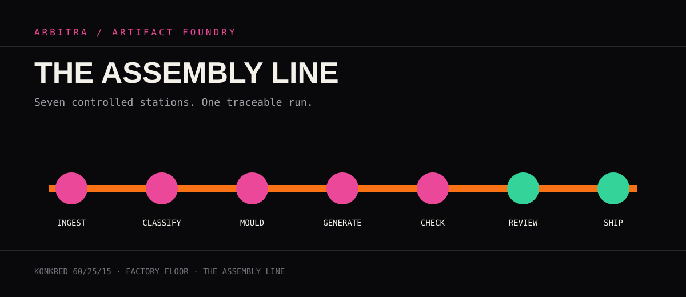</div>

## Factory system

### Project corpus → classify → select contract → generate → validate → review → package

| Station | What happens | Evidence produced |
|---|---|---|
| **Corpus intake** | A project source of truth is entered into `CorpusInput`. | Input context for the run |
| **Classification** | The dashboard and artifact registry organize work into categories. | Category, file manifest, generation flags |
| **Contract selection** | Each output is driven by a named artifact type and prompt policy. | Filename, content, metadata shape |
| **Generation** | `foundryService` selects Gemini Pro or Flash, adds thinking or grounding where configured, and retries transient calls. | Generated artifact content |
| **Validation gate** | Zod schemas parse artifact data and structured toolkit responses. | Pass/fail result and typed data |
| **Review** | Artifact cards, category groups, source links, and build logs expose the run. | Human-reviewable output and trace |
| **Packaging bay** | Selected or complete output is exported to PDF or ZIP; generated code remains source-ready. | `Arbitra_*.pdf`, `Arbitra_*.zip` |

<div align="center">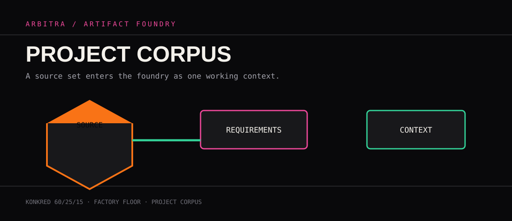</div>

## Artifact contracts

Contracts are the control surface between AI output and application state. Artifact schemas define required file identity and content; toolkit schemas cover analysis, grounding, and demo responses; `validateData` converts parse failures into a structured result rather than letting malformed data cross the boundary.

<div align="center">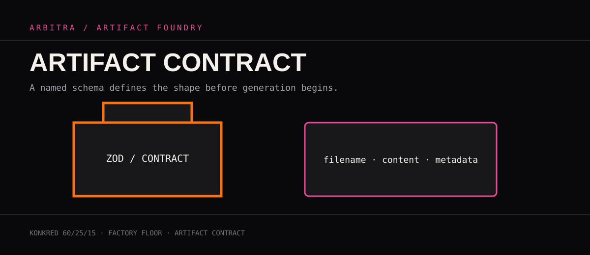</div>

The registry currently organizes outputs across business and strategy, product and design, technical architecture, deployment and operations, governance and compliance, blog/content, and custom artifacts. Examples include technical specifications, OpenAPI JSON, implementation guides, compliance reports, scripts, Python, JavaScript, and onboarding material.

## Corpus ingestion and source linkage

The corpus is the single working context supplied to generation. Category prompts combine that corpus with a base instruction and file-specific requirements. Grounded calls collect validated grounding chunks; Markdown artifacts can carry source links into the generated record. This makes a generated document inspectable without claiming that AI output is authoritative by itself.

## Validation gate and build log

<div align="center">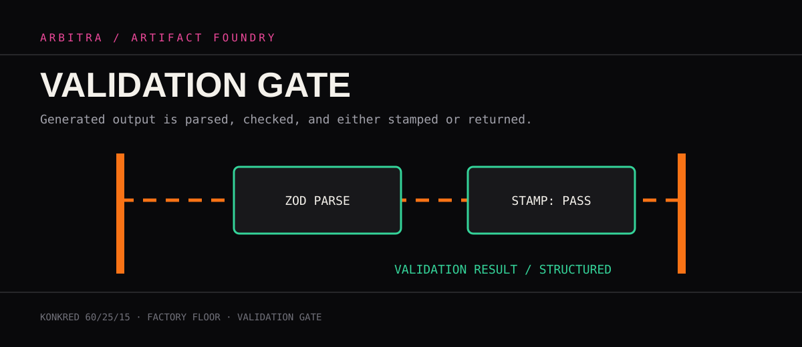</div>

Generation is orchestrated one file at a time. Failures are recorded in an error log, retries are bounded, and successful artifacts are placed back into category state. The build log surfaces progress, completed categories, and generated counts in the dashboard. Schema tests cover artifact, toolkit, and dashboard validation paths.

<div align="center">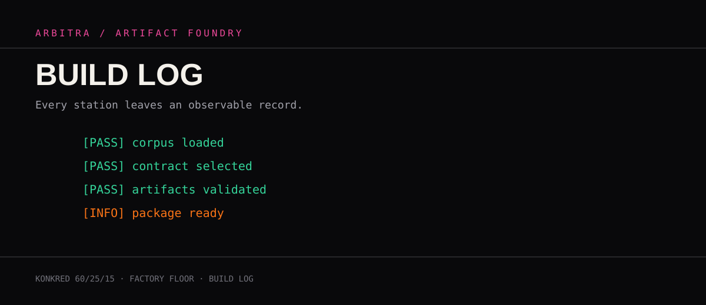</div>

## AI Toolkit

The toolkit is a parallel workbench for focused operations: grounded Google Search or Maps, image analysis and generation, image editing, video generation, transcription, text-to-speech, demo synthesis, file generation, code generation, and data analysis. State is held in React hooks and local storage where appropriate; service boundaries return explicit success/error unions.

<div align="center">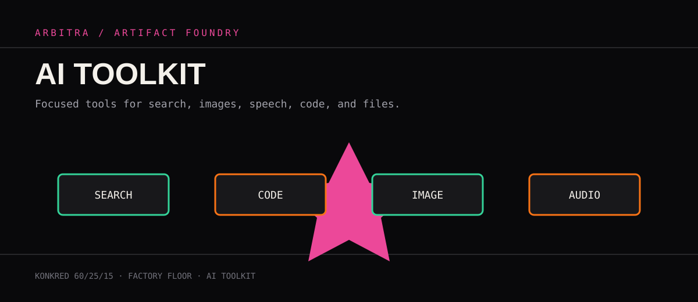</div>

### Data analysis

Data analysis requests a JSON response with a summary and chart data, then validates it with `AnalysisResultSchema` before the UI renders the result.

<div align="center">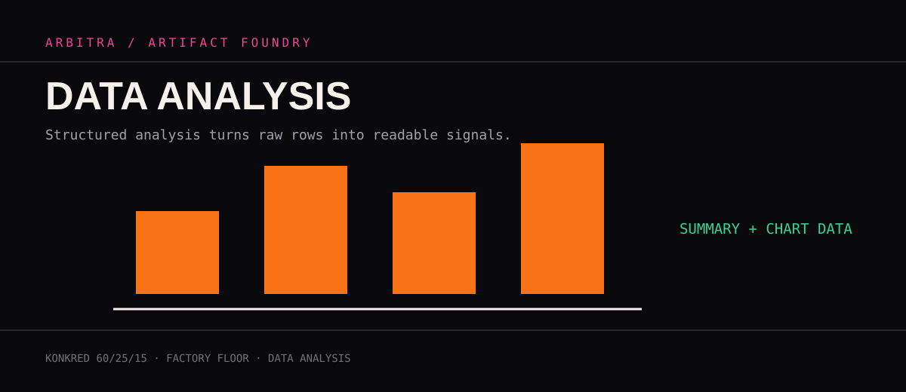</div>

### Code generation

`generateCode(prompt, language)` requests raw source, strips accidental fences, and returns code or a typed error. The file generation tab uses the same boundary for complete named files.

<div align="center">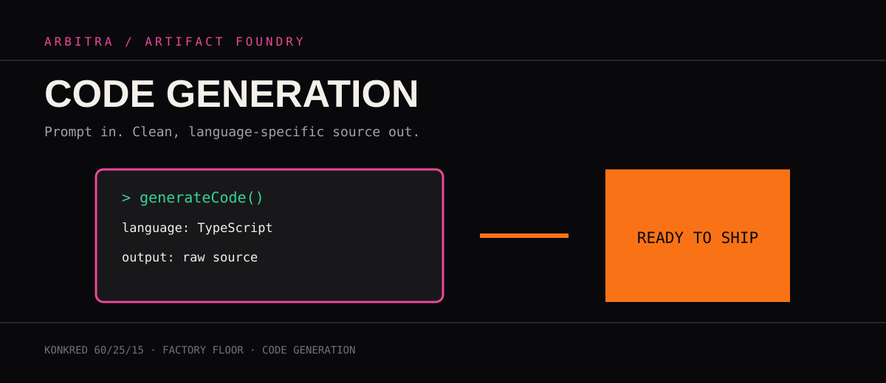</div>

## Delivery formats

<div align="center">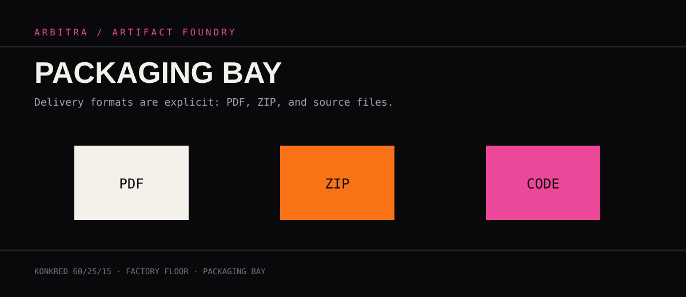</div>

`ArtifactDisplay` can export all or selected artifacts to a consolidated PDF using jsPDF, or create a categorized ZIP using JSZip with progress reporting. Generated source files, Markdown, JSON, scripts, and metadata remain available for repository handoff.

## Architecture

<div align="center">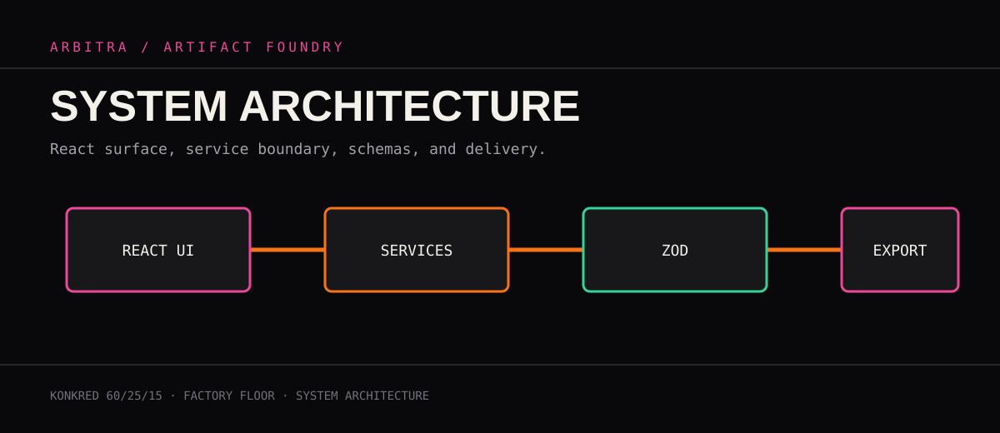</div>

```text
React UI (App, Dashboard, CorpusInput, ArtifactDisplay, Toolkit)
  ├─ contexts + hooks (state, local storage, metrics, generation history)
  ├─ services (foundryService, aiToolkitService, chatService)
  ├─ middleware + schemas (Zod validation and typed boundaries)
  ├─ registry/config (categories, contracts, models, limits)
  └─ delivery (jsPDF PDF export, JSZip package export)
```

The browser application is built with Vite, React 19, TypeScript, Zod, jsPDF, JSZip, and the Google GenAI SDK. API credentials are read from `GEMINI_API_KEY` by Vite configuration; live AI operations require that key, while schema and utility verification does not.

## Verification console

<div align="center">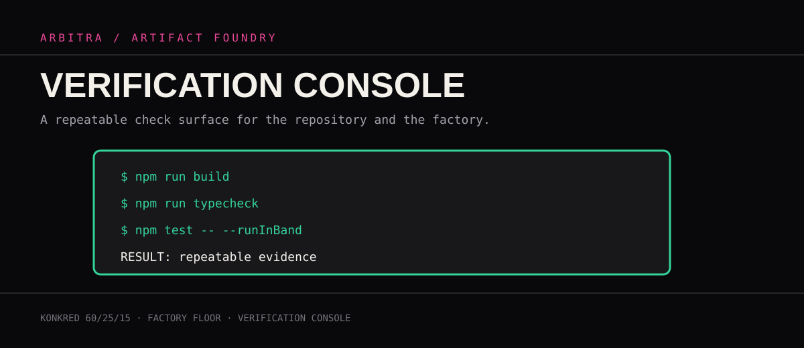</div>

```bash
npm install
npm run build
npm run typecheck
npm test -- --runInBand
```

The repository includes Jest-style test files for artifact and toolkit schemas, dashboard middleware, artifact/toolkit/dashboard utilities, and artifact/dashboard hooks. The current dependency set contains test definitions and Testing Library DOM matchers but no executable Jest runner or TypeScript Jest transformer; therefore this dossier does not add a test script that would falsely imply runnable tests. Build and TypeScript checks remain the executable baseline until a runner is intentionally introduced.

For a local UI session:

```bash
npm run dev
# open the Vite URL shown in the terminal
```

Use a corpus, generate one category, inspect the build log, open an artifact, and exercise PDF/ZIP export. Never put a live key in source control.

## Operations

- Keep artifact contracts and registry entries synchronized.
- Review generated content before external delivery.
- Preserve build logs and source links with exported packages.
- Treat grounding links as provenance, not as an automatic approval signal.
- Run `npm run build` and `npm run typecheck` for every change.
- Keep AI credentials in local environment configuration.

<div align="center">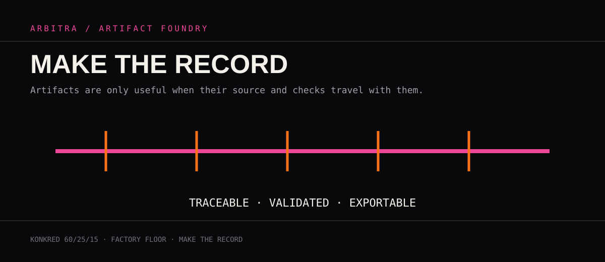</div>

**ARBITRA Artifact Foundry** · structured input · contract-led generation · validated delivery
