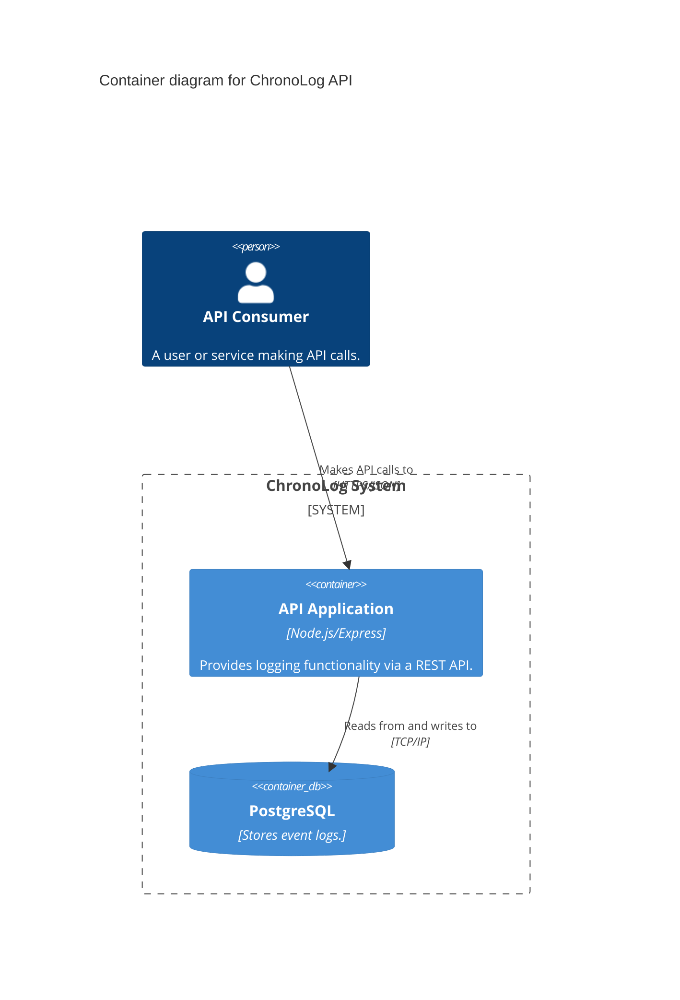

# Artifact Generation Examples

This file provides examples of input `corpus` and the kind of high-quality output you can expect from the Arbitra Foundry.

## Example 1: Simple Web API

### Input Corpus

```
Project Name: "ChronoLog API"
Core Functionality: A simple, fast, and scalable API for logging timestamped events.
Key Features:
- Endpoint to create a new event log (POST /logs).
- Endpoint to retrieve all logs (GET /logs).
- Event structure should include an ID, a timestamp, and a free-text message.
- Technology Stack: Node.js with Express.
- Deployment Target: Docker container.
- Security: Must include basic API key authentication.
```

### Expected Output (Partial)

#### `technical-specifications.md`

```markdown
# Technical Specifications: ChronoLog API

## 1. Introduction & Goals

This document details the technical architecture for the ChronoLog API, a high-performance service for timestamped event logging. The primary goals are speed, scalability, and ease of use, deployed as a containerized Node.js application.

## 2. System Architecture

The system is a monolithic Node.js application built with the Express framework. It exposes a RESTful API for log management.

### C4 Container Diagram



## 3. Data Models & Schemas

### Log Schema

-   `id`: UUID (Primary Key)
-   `timestamp`: ISO 8601 Datetime (Indexed)
-   `message`: TEXT

...

## 5. Security Considerations

-   **Authentication:** All API requests must include an `X-API-Key` header. The server will validate this key against a list of approved keys stored in environment variables.
-   **Rate Limiting:** A rate limit of 100 requests per minute per API key will be enforced to prevent abuse.
...
```

#### `api-integration.json` (OpenAPI Spec)

```json
{
  "openapi": "3.1.0",
  "info": {
    "title": "ChronoLog API",
    "version": "1.0.0",
    "description": "A simple, fast, and scalable API for logging timestamped events."
  },
  "paths": {
    "/logs": {
      "post": {
        "summary": "Create a new event log",
        "requestBody": {
          "required": true,
          "content": {
            "application/json": {
              "schema": {
                "type": "object",
                "properties": {
                  "message": {
                    "type": "string"
                  }
                },
                "required": ["message"]
              }
            }
          }
        },
        "responses": {
          "201": {
            "description": "Log created successfully"
          }
        }
      }
    }
  }
}
```